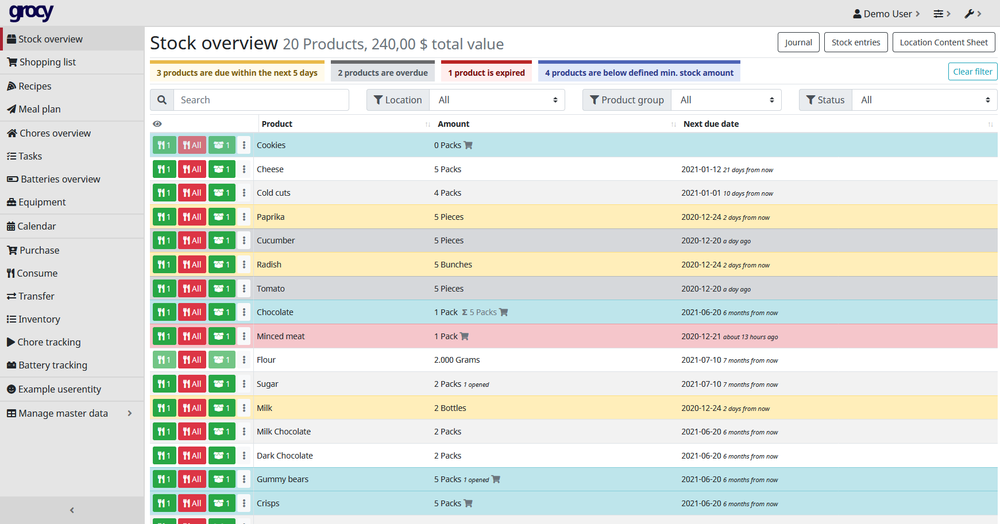

<!--
N.B.: This README was automatically generated by https://github.com/YunoHost/apps/tree/master/tools/README-generator
It shall NOT be edited by hand.
-->

# Grocy for YunoHost

[](https://dash.yunohost.org/appci/app/grocy)    
[](https://install-app.yunohost.org/?app=grocy)

*[Lire ce readme en français.](./README_fr.md)*

> *This package allows you to install Grocy quickly and simply on a YunoHost server.
If you don't have YunoHost, please consult [the guide](https://yunohost.org/#/install) to learn how to install it.*

## Overview

grocy is a web-based self-hosted groceries & household management solution for your home.

**Shipped version:** 3.3.1~ynh1

**Demo:** https://en.demo.grocy.info/stockoverview

## Screenshots



## Disclaimers / important information

## Configuration

 Default login
```
	user: admin
	password: admin
```

## Limitations

:warning: For now, Grocy must be installed in a root domain or subdirectory.

## Documentation and resources

* Official app website: <https://grocy.info/>
* Upstream app code repository: <https://github.com/grocy/grocy>
* YunoHost documentation for this app: <https://yunohost.org/app_grocy>
* Report a bug: <https://github.com/YunoHost-Apps/grocy_ynh/issues>

## Developer info

Please send your pull request to the [testing branch](https://github.com/YunoHost-Apps/grocy_ynh/tree/testing).

To try the testing branch, please proceed like that.

``` bash
sudo yunohost app install https://github.com/YunoHost-Apps/grocy_ynh/tree/testing --debug
or
sudo yunohost app upgrade grocy -u https://github.com/YunoHost-Apps/grocy_ynh/tree/testing --debug
```

**More info regarding app packaging:** <https://yunohost.org/packaging_apps>
