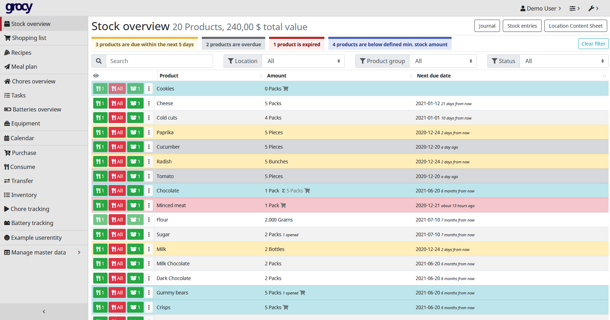

<!--
N.B.: Diese README wurde automatisch von <https://github.com/YunoHost/apps/tree/master/tools/readme_generator> generiert.
Sie darf NICHT von Hand bearbeitet werden.
-->

# Grocy für YunoHost

[](https://ci-apps.yunohost.org/ci/apps/grocy/)


[](https://install-app.yunohost.org/?app=grocy)

*[Dieses README in anderen Sprachen lesen.](./ALL_README.md)*

> *Mit diesem Paket können Sie Grocy schnell und einfach auf einem YunoHost-Server installieren.*  
> *Wenn Sie YunoHost nicht haben, lesen Sie bitte [die Anleitung](https://yunohost.org/install), um zu erfahren, wie Sie es installieren.*

## Übersicht

Grocy is a web-based self-hosted groceries & household management solution for your home.

**Ausgelieferte Version:** 4.5.0~ynh1

**Demo:** <https://en.demo.grocy.info/stockoverview>

## Bildschirmfotos



## Dokumentation und Ressourcen

- Offizielle Website der App: <https://grocy.info/>
- Upstream App Repository: <https://github.com/grocy/grocy>
- YunoHost-Shop: <https://apps.yunohost.org/app/grocy>
- Einen Fehler melden: <https://github.com/YunoHost-Apps/grocy_ynh/issues>

## Entwicklerinformationen

Bitte senden Sie Ihren Pull-Request an den [`testing` branch](https://github.com/YunoHost-Apps/grocy_ynh/tree/testing).

Um den `testing` Branch auszuprobieren, gehen Sie bitte wie folgt vor:

```bash
sudo yunohost app install https://github.com/YunoHost-Apps/grocy_ynh/tree/testing --debug
oder
sudo yunohost app upgrade grocy -u https://github.com/YunoHost-Apps/grocy_ynh/tree/testing --debug
```

**Weitere Informationen zur App-Paketierung:** <https://yunohost.org/packaging_apps>
